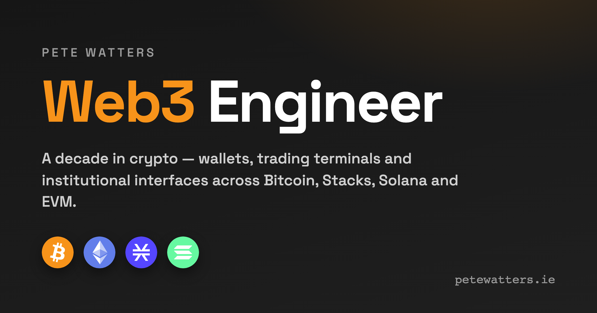

# petewatters.ie

Personal portfolio and blog built with Astro, hosted on Cloudflare Pages.

**Live:** [petewatters.ie](https://petewatters.ie)

## Stack

- [Astro](https://astro.build) v5 — static site generation, content collections
- TypeScript
- Cloudflare Pages — hosting and deployment
- Playwright — E2E tests
- Vite PWA — offline support and service worker

## Contributing & local development

Setup commands, testing, project structure, branching model, and PR
conventions live in [CONTRIBUTING.md](./CONTRIBUTING.md).

## License

This repository contains two different kinds of work, governed separately.

### Code — AGPL-3.0

All source code (`*.astro`, `*.ts`, `*.js`, CSS, build config, GitHub Actions
workflows) is licensed under the GNU Affero General Public License v3.0.
See [LICENSE](./LICENSE) for the full text.

In short: you may use, copy, modify, and distribute this code, including
running modified versions on a server, **provided that** you make the
complete corresponding source of your version available under the same
license to anyone who interacts with it.

### Content — © 2026 Pete Watters, all rights reserved

All written content in this repository — including but not limited to blog
posts (`src/content/blog/`), CV text (`src/content/cv/`), case study prose
(`src/content/work/`), project descriptions, images, the name "Pete
Watters", and related personal/professional identity — is copyright
© 2026 Pete Watters and is **not** covered by the AGPL.

You may not reuse, republish, or redistribute the content of this site
without prior written permission. This includes training data ingestion
for commercial LLMs. Quoting brief passages for review or commentary is
fair use and welcome.
