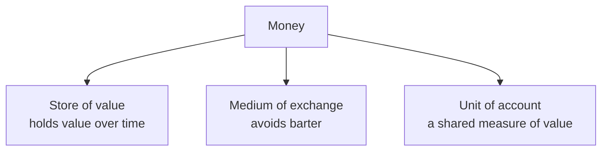
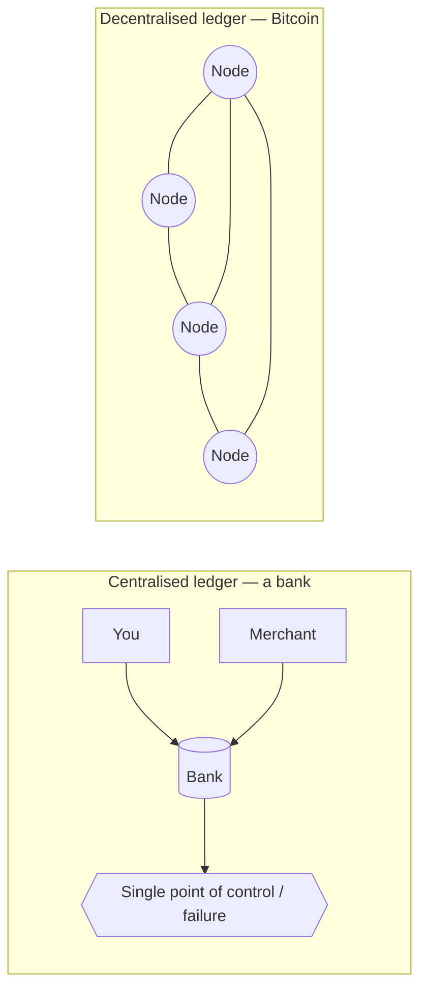
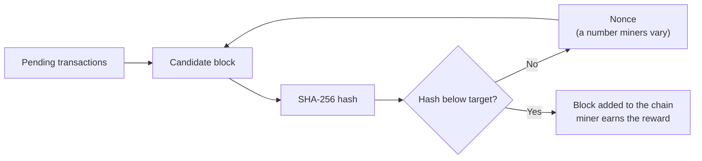
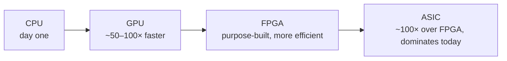

I've spent the better part of eight years building consumer crypto products — wallets, trading tools, signing flows. I run my own node, I self-custody, and a while back I sat the Certified Bitcoin Professional exam mostly to force myself to learn the fundamentals properly rather than by osmosis. This post is the version of those fundamentals I wish someone had handed me on day one: Bitcoin built up from first principles, no hype, no price talk.

## Start with money, not Bitcoin

Before you can say what Bitcoin is, it helps to be precise about what money does. Money has three jobs. It's a **store of value**, so the work you do today still buys something next year. It's a **medium of exchange**, so you don't have to find someone who happens to want exactly what you have and has exactly what you want — economists call that the double coincidence of wants, and bartering your way around it is miserable. And it's a **unit of account**, a shared measuring stick so a price means the same thing to everyone.

Anything that does all three well can be money. The interesting question isn't *what* money is — it's *who keeps the books*.

## The ledger is the whole game

Every form of money is really a ledger: a record of who owns what. The question Bitcoin answers is who maintains that record.

A bank account is a **centralised ledger**. The bank keeps the book, and that arrangement comes with a fixed set of properties: it has to reconcile internally and against other institutions, it can impose whatever restrictions it likes, it's a single point of control, and — critically — it's a single point of failure. If it goes down, gets hacked, or decides you can't move your money today, you're stuck. Middlemen sit in the flow, and actions happen on your behalf rather than by you.

A **decentralised ledger** flips that. Instead of one trusted bookkeeper, thousands of equal nodes around the world each hold a copy and agree on it. There's no chain of command and no single point of failure. The closest everyday analogy is a shared Google Doc versus emailing a spreadsheet back and forth: with the emailed file, someone always owns the "real" copy and you're forever reconciling versions; with the shared doc, everyone's looking at the same living record.

That sounds nice in principle, but it raises an immediate problem. If nobody's in charge, what stops me from spending the same coin twice — telling one half of the network I paid you and the other half I paid myself?

## Proof of work is the answer to double-spending

This is the part that took me longest to actually *get*, as opposed to repeat. The thing that makes a leaderless ledger trustworthy is **proof of work**.

Roughly: transactions waiting to be settled are bundled into a candidate block. Miners then race to find a number — a **nonce** — that, when fed through the SHA-256 hash function along with the block's data, produces a hash below a target value. A hash is just a fingerprint: any input gives a fixed-length output, the same input always gives the same output, and you can't run it backwards. So there's no clever shortcut. The only way to find a qualifying nonce is to guess, billions of times a second, until one works.

When a miner finds one, they broadcast the block, everyone else can verify it instantly (checking is cheap; finding it was expensive), and it gets chained onto the previous block — each block carrying the fingerprint of the one before it. To rewrite history you'd have to redo the work for that block *and* every block after it, faster than the rest of the network is extending the honest chain. That's the trick: the security isn't a password or a permission, it's accumulated, unforgeable effort. The work *is* the proof.

This is also why you hear about a "51% attack." Someone with the majority of the network's hashing power could censor or reverse their own recent transactions — but, notably, they still can't steal coins out of your wallet, because that would need your private key, not hash power. The scary-sounding attack is narrower than the headlines suggest.

## The mining arms race

Because the reward is real money, mining has been a relentless efficiency race. It started on ordinary **CPUs**. Then people realised **GPUs** were dramatically better at the same repetitive maths — tens of times faster. Then came **FPGAs**, chips you could program for the job, more efficient again. And finally **ASICs**: chips that do exactly one thing, hash SHA-256, and do nothing else. Each step was a large multiple over the last.

The practical upshot: trying to mine a single bitcoin on a laptop today would take you longer than you'll be alive. The network's collective effort is the whole point — that effort is what makes the ledger expensive to attack and cheap to trust.

## Why it's scarce on purpose

The last piece is supply. Miners are paid a block reward, and that reward halves roughly every four years — every 210,000 blocks, to be exact. The total supply is capped at 21 million coins, and over time the block reward shrinks toward zero while transaction fees take over as the incentive. It's deliberately deflationary, in deliberate contrast to a fiat currency that a central bank can print more of. Whether you think that's a feature or a flaw is a values question, not a technical one — but it's a *designed* property, not an accident.

## Why this matters if you build software

When you actually build on this stuff, the abstractions stop being academic. "No single point of failure" means there's no support line to call when a user signs the wrong transaction — the signing flow you build *is* the safety net. "The work is the proof" means finality is probabilistic, and your UI has to be honest about that rather than flashing a green tick the instant a payment is broadcast. The fundamentals aren't trivia; they're the constraints you're designing against.

That's Bitcoin from the ground up: money's three jobs, a ledger nobody owns, proof of work to keep it honest, an arms race to secure it, and a supply that's scarce by design. Everything else — layer-twos, stablecoins, the entire zoo of altcoins — is a variation on these moves. Get these right and the rest is much easier to reason about.
